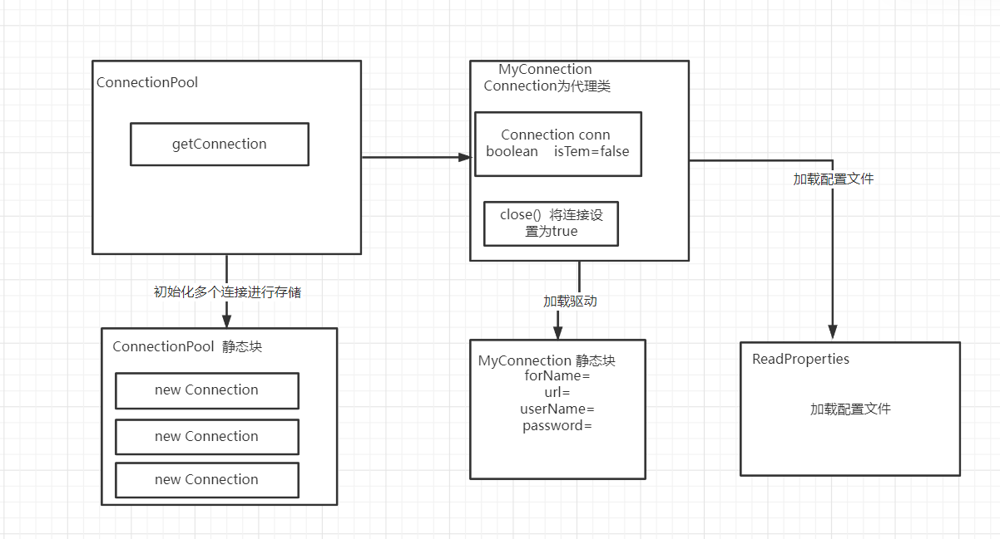

# 基于JDBC的连接池

# 1 基本介绍

本项目是基于JDBC进行封装的连接池，为了加强自己的基础和能更深入解框架的本质， 自己实现了框架的常用功 能。本质是提高连接性能、让连接可复用、减少代码的冗余。

## 1.1原生JDBC连接过程

~~~java
//1导包
//2加载驱动
Class.forName("com.mysql.jdbc.Driver");  
//3获取连接
Connection conn = DriverManager.getConnection(url, user, password);
//4创建状态参数
PreparedStatement pstat = conn.prepareStatement(sql);
//5执行数据库操作
pstat.executeUpdate();
//6关闭连接
conn.close()
~~~

## 1.2 存在的问题

1、创建**连接时间很慢**(让整个执行过程很慢)

2、**连接不能复用**(每一次都需要创建 DAO层 ，而DAO有好多方法， 每一个方法都需要JDBC)


# 2 基本使用

## 2.1 引入依懒包

```
<dependency>
     <groupId>mysql</groupId>
     <artifactId>mysql-connector-java</artifactId>
     <version>5.1.47</version>
</dependency>
```

## 2.2 配置文件

classpath目录下创建configure.properties文件

```
forName=com.mysql.jdbc.Driver
url=jdbc:mysql://localhost:3306/atm
user=root
apassword=root
nuberConn=2
```

## 2.3 代码编写

```
//获取连接
Connection conn = ConnectionPoor.getPoor().getConnection();
//创建状态参数
PreparedStatement pstat = conn.prepareStatement(sql);
//执行数据库操作
pstat.executeQuery();
//关闭连接 实际上不是真正的关闭
conn.close();
```

# 3 基本原理

## 3.1 核心逻辑

1、开始可**创建好多个连接进行保存** ，而这些连接当作一个资源复用

2、将创建好的多个连接存储在集合中

3、并将连接设置为正在使用中,状态设置为true（false 连接空闲状态是可连接的，true是正在使用中）

4、当连接使用完后将连接放会连接池（将状态设置为false）




